# 线程池中的异常处理

## 先放结论

1. 可以override 线程池的afterExecute 方法处理异常
2. 可以在获取线程池运行结果时，处理异常
3. 可以在线程中用try...catch 捕获，处理异常

## 问题现象

一个任务放入线程池中执行，似乎未执行，无正常执行的日志，也没有异常日志。

分析发现，该任务抛出了一个异常，导致不能正常执行，但并没有异常打印，异常被线程池吃掉

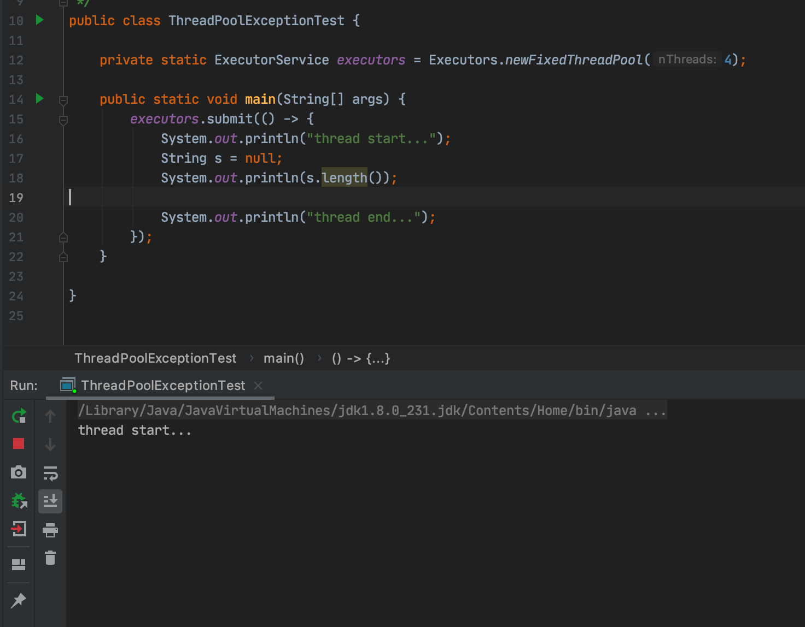

## 源码分析

先看线程池构造方法，可以看到newFixedThreadPool 具体的实现类是ThreadPoolExecutor
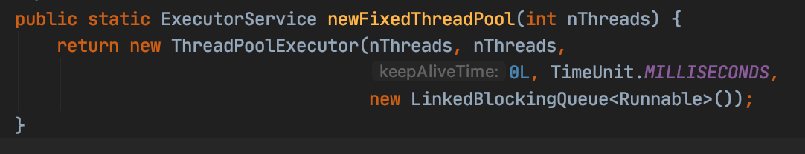

再看submit 方法，这个方法是在ExecutorService 接口中定义，在ThreadPoolExecutor 的父类AbstractExecutorService 中实现，ThreadPoolExecutor 中并没有override
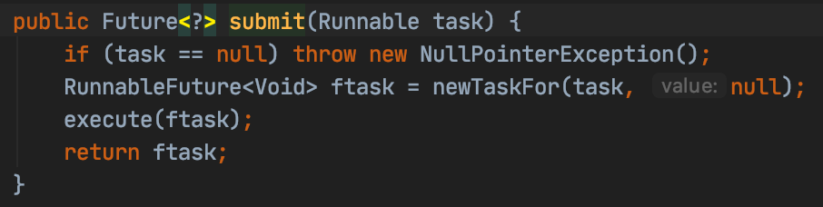
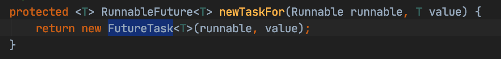

FutureTask 构造方法
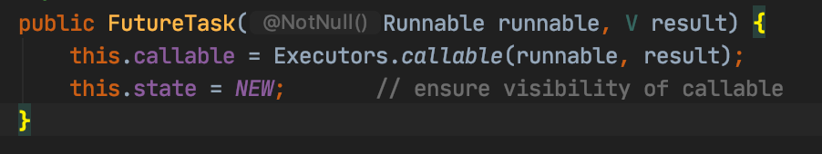

Executors.callable 构造了RunnableAdapter 对象
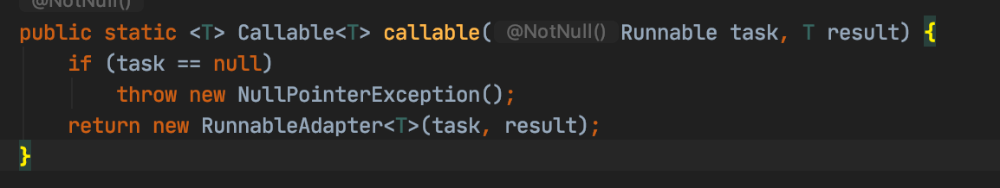
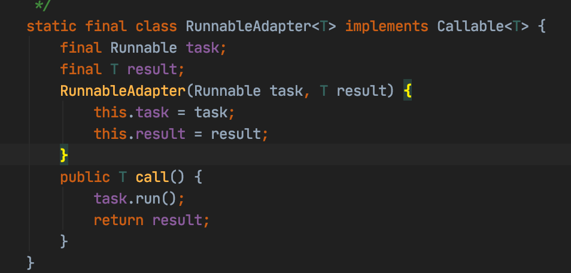

**总结一下，线程池的newTaskFor 方法将我们提交的runnable 对象包装成了一个FutureTask 对象**

接下来，就会把任务提交给线程池调度处理 java.util.concurrent.ThreadPoolExecutor.execute()
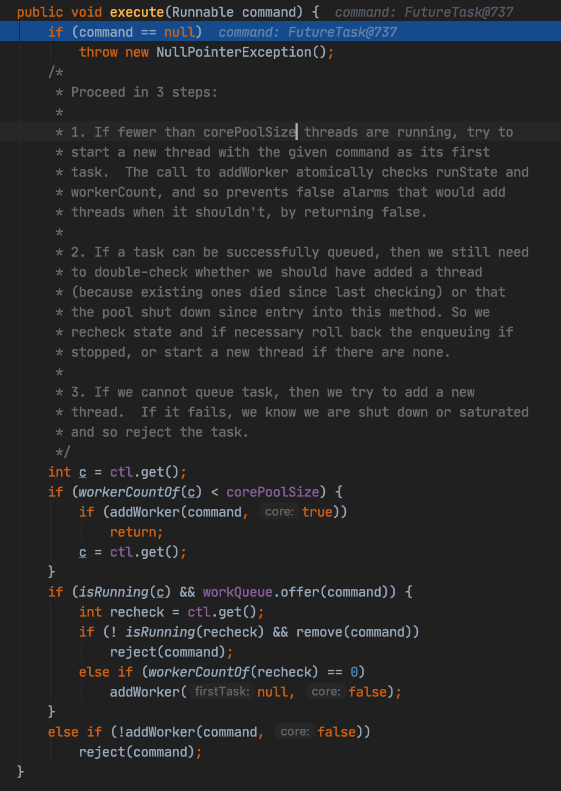

调度时，若正在运行的线程数小于线程池核心线程数，则addWorker()将任务提供给线程处理；
若工作线程数大于等于核心线程数，则将任务添加到等待队列；
若等待队列已满，则尝试创建新线程处理任务；
当工作线程数大于等于线程池的最大线程数时，则创建新线程会失败，则拒绝该任务

可以发现核心方法是addWorker()，其内部会将任务封装为Worker 对象
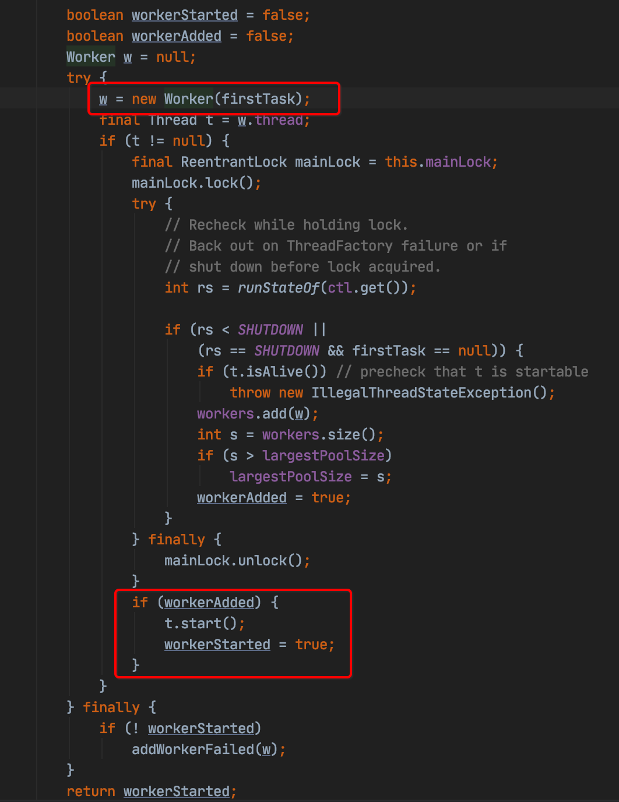

Worker 对象，可以看出，真正执行任务的是run方法中的runWorker()
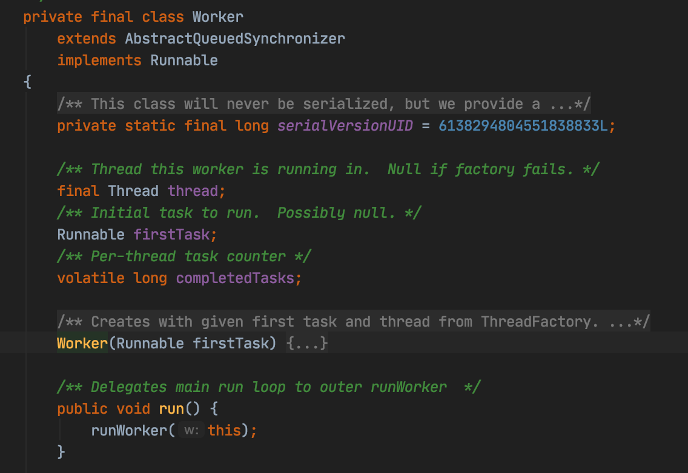

runWorker() 执行传入的Worker 中的任务，或者从队列中获取等待的任务(getTask 获取队列中的任务)
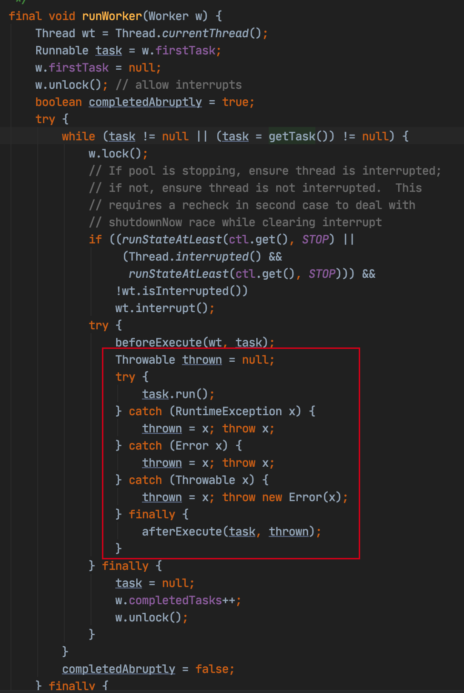

可以看到，关键代码执行了任务的run 方法，并且在catch 异常之后，再次向外抛出。

finally 中有一个方法afterExecute() ，但方法并未做什么，需要的时候，比如自定义线程池时，可以override 该方法处理异常
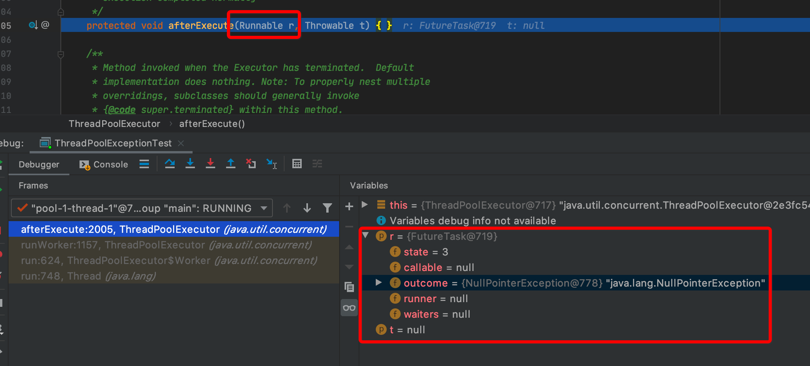

再看task.run()，由于任务被包装成了FutureTask 对象，则会执行FutureTask 的run 方法
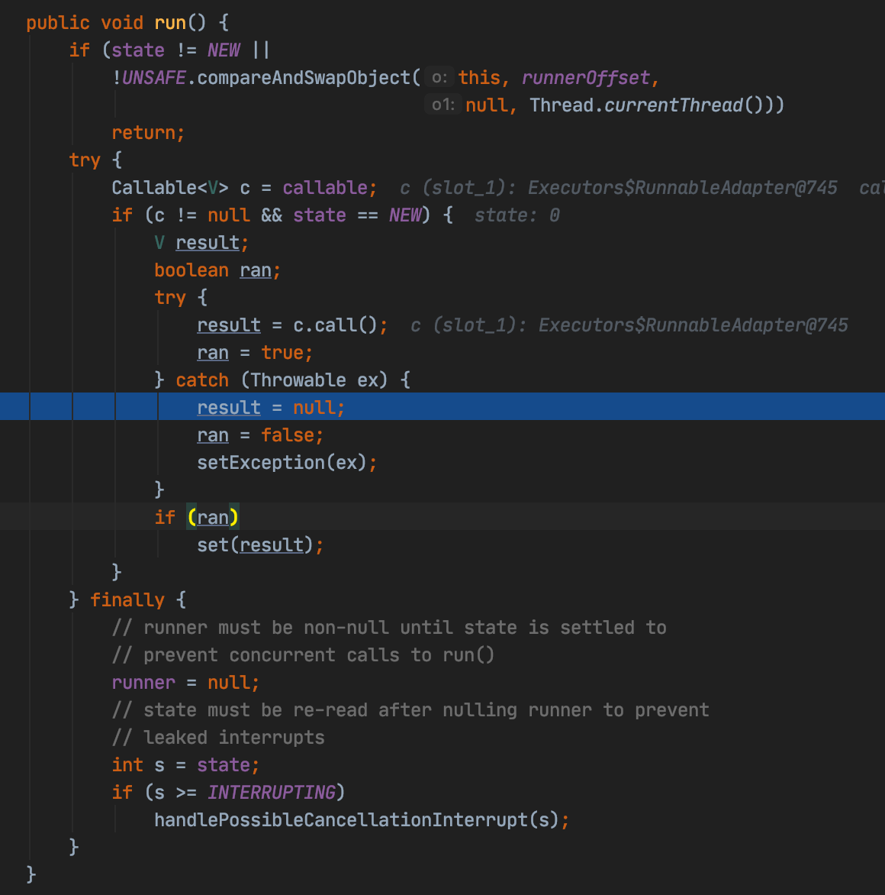

出现异常时，并不会抛出异常，而是将异常写入outcome，并标识为EXCEPTION
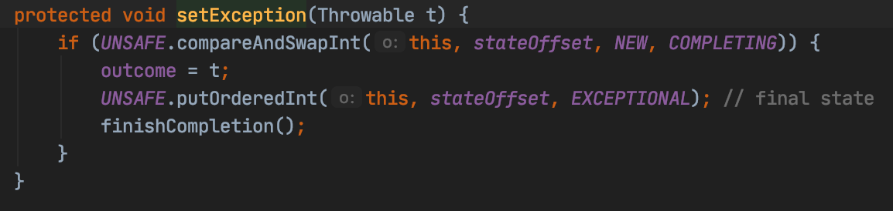

outcome 值在使用FutureTask 的返回值Future.get()时会抛出，可以获取处理
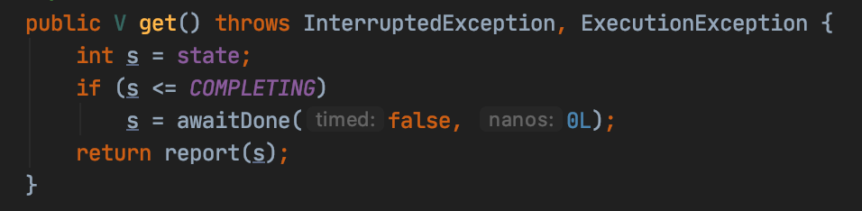
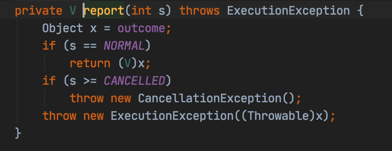

可以看到，线程中的异常，在获取FutureTask 结果的时候，获取到了

